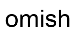
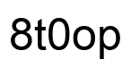
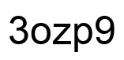
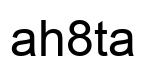
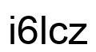
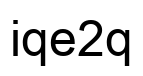
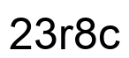
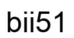

## RandText dataset










---

### Introduction

This is an official release of RandText dataset ([RobustScanner: Dynamically Enhancing Positional Clues for Robust Text Recognition (ECCV 2020)](https://www.ecva.net/papers/eccv_2020/papers_ECCV/papers/123640137.pdf) ).

RandText contains 500 test images. We synthesize them by pasting black random character sequences on white background images.
The character set contains small and capital letters, and numbers.

---

### Download

[ [RandText](https://raw.githubusercontent.com/bigvideoresearch/RandText/master/data/RandText.zip) ]

---

### Reference

```
@InProceedings{yue2020robustscanner,
  title={RobustScanner: Dynamically Enhancing Positional Clues for Robust Text Recognition},
  author={Yue, Xiaoyu and Kuang, Zhanghui and Lin, Chenhao and Sun, Hongbin and Zhang, Wayne},
  booktitle = {European Conference on Computer Vision (ECCV)},  
  year = {2020}  
}
```